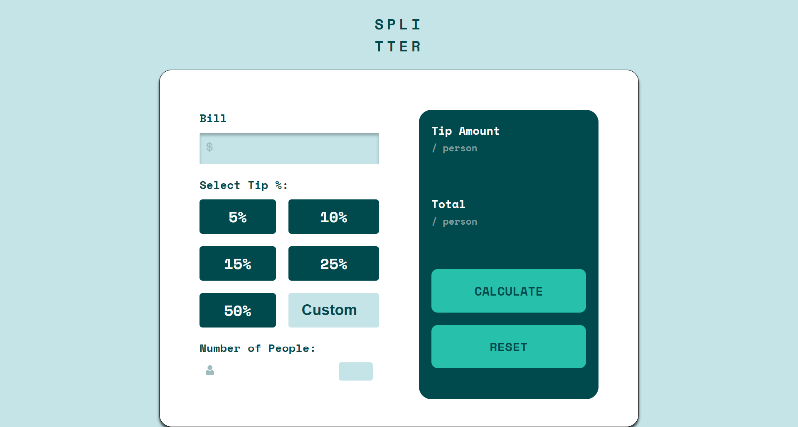

# Frontend Mentor - Tip calculator app solution

This is a solution to the [Tip calculator app challenge on Frontend Mentor](https://www.frontendmentor.io/challenges/tip-calculator-app-ugJNGbJUX). Frontend Mentor challenges help you improve your coding skills by building realistic projects.

## Table of contents

- [Overview](#overview)
  - [The challenge](#the-challenge)
  - [Screenshot](#screenshot)
  - [Links](#links)
- [My process](#my-process)
  - [Built with](#built-with)
  - [What I learned](#what-i-learned)
  - [Continued development](#continued-development)
  - [Useful resources](#useful-resources)
- [Author](#author)
- [Acknowledgments](#acknowledgments)


## Overview
This is my first JavaScript Challenge submission to Front End Mentor
### The challenge

Users should be able to:

- View the optimal layout for the app depending on their device's screen size
- See hover states for all interactive elements on the page
- Calculate the correct tip and total cost of the bill per person

### Screenshot


  


### Links

- Solution URL: [https://femtipcalculator2023.netlify.app/](https://femtipcalculator2023.netlify.app/)


## My process

### Built with

-Java Script 
-Semantic HTML5 markup
- CSS custom properties
- Flexbox
- CSS Grid
- Mobile-first workflow


### What I learned

-Javascript conditionals

```js
if (isNaN(billTotal) || isNaN(numPeople) || billTotal <= 0 || numPeople <= 0) {
    alert('Please enter valid numbers for Bill Total and Number of People! Common!');
    return;
  }
```

I am particularly fond of this line. I had a friend complain that tip calculator always calculate the tip on the whole bill including the tax. He felt the tip should be calculated based on the total bill without the tax. This simple line solved that problem. Now it introduced another problem I will add once the submission is over. I would like to add a toggle to allow the user to select taxes if any so the calculator can account for it. 
```js
  // Remove 15% tax from bill total
  billTotal = billTotal / 1.15;
```


### Continued development

This project helped my practice my CSS especially. I continue to learn and improve as each day passes. I am particularly happy it works!


## Author

- Website - [RE Wilson](https://rw2023-react-portfolio.netlify.app/)
- Frontend Mentor - [@RW2023](https://www.frontendmentor.io/profile/RW2023)
- Instagram - [@ryanwilsonimages](https://www.instagram.com/ryanwilsonimages/)

## Acknowledgments

Special thanks to my Discord community Front End Collab for all their help and support. 